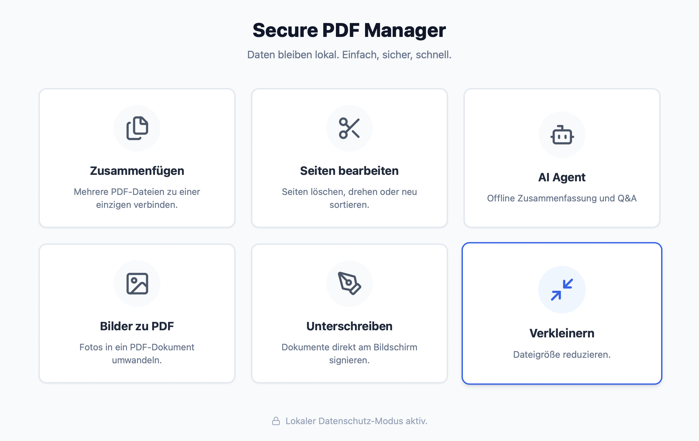

# 🔒 Secure PDF Manager


> **Deine Daten gehören dir.** Ein leistungsstarkes Tool zum Bearbeiten von PDFs – sicher, schnell und 100% offline.
<p align="center">
  
</p>

---

## 📖 Über das Projekt

Der **Secure PDF Manager** wurde aus einer einfachen Notwendigkeit heraus geboren: PDF-Tools sind oft unnötig kompliziert, teuer oder zwingen Nutzer dazu, vertrauliche Dokumente in die Cloud hochzuladen.

Wir bei **Becomsolut** glauben: **Niemand sollte sensible Dokumente (wie Verträge oder Steuerdaten) ins Internet hochladen müssen, nur um zwei Seiten zusammenzufügen.**

Dieses Tool löst genau dieses Problem. Es nutzt die Power von Rust und Tauri für maximale Performance und Sicherheit, verlässt niemals deinen Computer und ist Open Source.

### ✨ Features

* **🛡️ 100% Offline & Privat:** Die gesamte Verarbeitung passiert lokal auf deinem Gerät. Keine Cloud, kein Upload.
* **⚡ Blitzschnell:** Dank Rust-Backend extrem ressourcensparend und performant.
* **📂 Merge & Split:** Füge mehrere PDFs zusammen oder extrahiere einzelne Seiten.
* **🔐 Sicherheit:** Verschlüssele PDFs oder entferne Passwörter (sofern bekannt).
* **🖱️ Einfache Bedienung:** Modernes UI mit Drag & Drop Support.

---

## 📥 Download & Nutzung

**Für normale Nutzer (Windows, macOS, Linux):**

Du musst nichts programmieren. Lade einfach die aktuelle Version für dein Betriebssystem herunter:

👉 **[Hier klicken für den neuesten Download (Releases)](../../releases)**

1.  Datei herunterladen (z.B. `.exe` oder `.dmg`).
2.  Installieren/Ausführen.
3.  Dateien reinziehen und loslegen.

---

## 🛠 Für Entwickler (Build from Source)

Wenn du den Code inspizieren oder selbst bauen möchtest:

### Voraussetzungen

* **Node.js** (v18 oder neuer)
* **Rust** (via [rustup](https://rustup.rs/))
* Systemabhängigkeiten für Tauri (siehe [Tauri Docs](https://tauri.app/v1/guides/getting-started/prerequisites))

### Installation

1.  Repository klonen:
    ```bash
    git clone [https://github.com/Becomsolut/secure-pdf-manager.git](https://github.com/Becomsolut/secure-pdf-manager.git)
    cd secure-pdf-manager
    ```

2.  Abhängigkeiten installieren:
    ```bash
    npm install
    ```

3.  App im Dev-Modus starten:
    ```bash
    npm run tauri dev
    ```

4.  Release-Build erstellen:
    ```bash
    npm run tauri build
    ```
    *(Das Binary findest du dann unter `src-tauri/target/release/bundle`)*

---

## 🏗 Tech Stack

Wir setzen auf moderne, sichere Technologien:

* **Core:** [Tauri v2](https://tauri.app) (Sicherheit & OS-Integration)
* **Backend:** Rust (Performance & PDF-Logik)
* **Frontend:** TypeScript / React (User Interface)

---

## 🤝 Mitwirken (Contributing)

Beiträge sind herzlich willkommen! Da dies ein Open-Source-Projekt ist, freuen wir uns über Pull Requests, Bug Reports oder Vorschläge.

1.  Forke das Projekt
2.  Erstelle deinen Feature Branch (`git checkout -b feature/AmazingFeature`)
3.  Committe deine Änderungen (`git commit -m 'Add some AmazingFeature'`)
4.  Pushe in den Branch (`git push origin feature/AmazingFeature`)
5.  Öffne einen Pull Request

---

## 🏢 Powered by Becomsolut

Dieses Projekt wird entwickelt und gewartet von **Becomsolut**.

Wir stehen für digitale Lösungen, die funktionieren. Der Secure PDF Manager ist unser Beitrag zur Community, um Datenschutz für jeden zugänglich zu machen.

---

## 📄 Lizenz

Veröffentlicht unter der **MIT License**.
Copyright © 2025 Becomsolut.